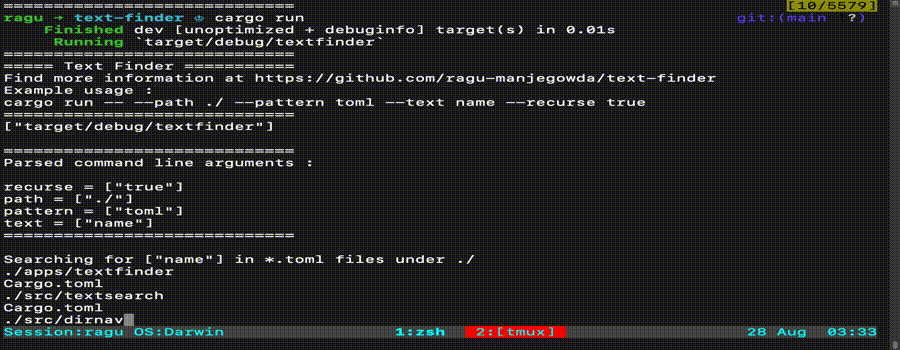
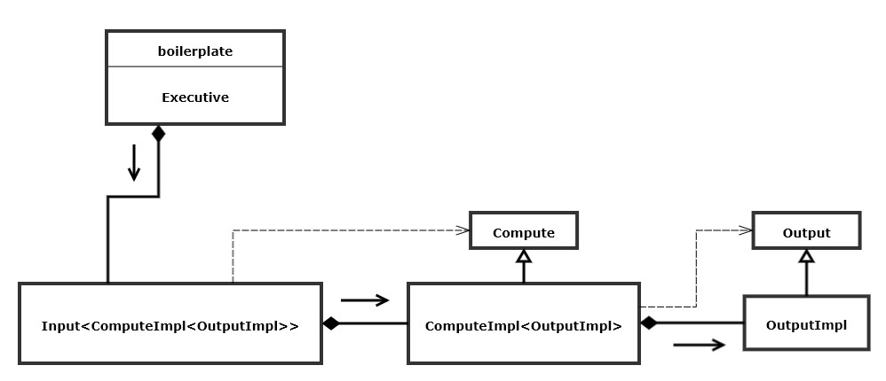
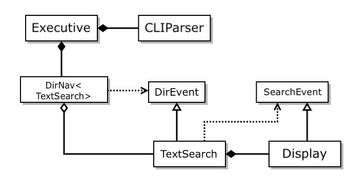

  

# Why Rust

This project is my first baby step towards learning [RUST](https://www.rust-lang.org/).

If you are looking for a reason to `why Rust`, here is the video that I highly recommend - [Considering Rust](https://www.youtube.com/watch?v=DnT-LUQgc7s)

  

# Text Finder

|  |
|:--:| 
| ***Text Finder in action - searching for "name" in \*.toml files under "./"*** |

Text Finder is a tool for locating files containing text that matches a specified regular expression.  
It uses the facilities of RustDirNav and RustCmdLine libraries, and
std::fs and regex crates.

It can be used to:
 * Find all files in a directory subtree with text that matches a
    specified regular expression.
 * Find all files that have specified extensions (patterns).
 * List all directories and their files in some directory subtree.

  

# Design

Traits are specified by caller and implemented by called. This reverses 
the dependency chain **Please feel free to check the dependencies in Cargo.toml files** and hence called ***Dependency Inversion Principle*** or ***Type Erase***

  

This is how text-finder packages are implemented according to the dependency inversion principle explained above.

## Pros
 * Each component can be built and compiled separately.
 * Continuous output, good ergonomics for user.
 * Input, Compute and Output are decoupled, they depend only on the 
   interface defined by the upstream component.

## Cons
 * Little complex to implement
 * Each component needs to use factory function to create it's down 
   stream component.

  

# Dependencies and Build instructions

## Using docker

Download image and start Docker interactive container

    $ ./run.sh # $HOME is mounted to /mnt inside container

***You might have to modify run script according to your needs.***

## Native
Highly recommend installing rust with [**rustup**](https://www.rust-lang.org/tools/install).

## Build and Run

Each module has examples and tests (refer workflow file for more info).  
For example, use the below command to run executive (text-finder) example app.

    $ cargo run --example executive_example_app

  

# Credits and References

I am indebted to [Prof. Dr. Jim Fawcett](https://jimfawcett.github.io/) for 
motivating me (and many others) to learn rust and taking time to [teach Rust](https://www.youtube.com/playlist?list=PLRqLz6z12zQp3eNC6cOtMa1zlhBimMHkD) for all of his former students through bi-weekly sessions.

This project and it's design principles are largely based on what he taught.
